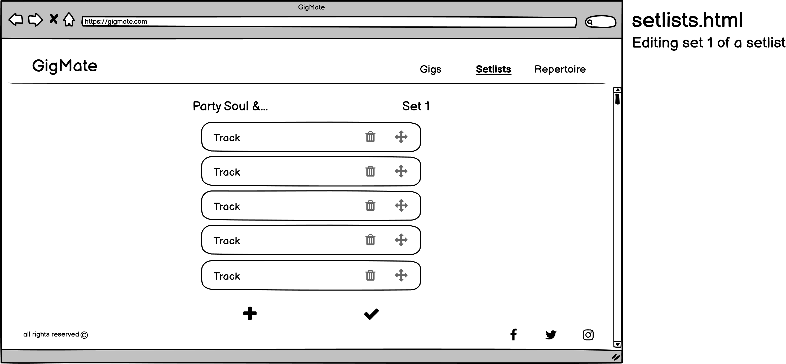
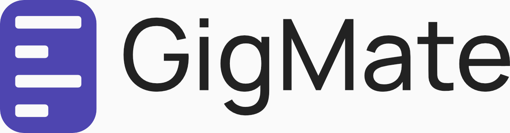

# GigMate

![image]

This project was developed for the Interactive Front End Development module within the Diploma in Web Application Development course provided by Code Institute.

![link to view GitHub page deployment]

# Contents

1. [UX](#UX)
    - [Strategy](#Strategy)
        - [Project Goals](#Project-Goals)
        - [User Stories](#User-Stories) 
    - [Scope](#Scope)
    - [Structure](#Structure)
    - [Skeleton](#Skeleton)
        - [Mobile Wireframes](#Mobile-Wireframes)
        - [Tablet Wireframes](#Tablet-Wireframes)
        - [Desktop Wireframes](#Desktop-Wireframes)
    - [Surface](#Surface)

2. [Features](#Features)
    - [Current Features](#Current-Features)
    - [Future Features](#Future-Features)

3. [Technologies](#Technologies)

4. [Testing](#Testing)

5. [Deployment](#Deployment)
    - [Deploying via GitHub Pages](#Deploying-via-GitHub-Pages)
    - [Forking the Repository](#Forking-the-Repository)
    - [Cloning the Repository](#Cloning-the-Repository)
        - [Using GitPod](#Using-GitPod)
        - [Using a Local IDE](#Using-a-Local-IDE)

6. [Credits](#Credits)
    - [Code](#Code)
    - [Media](#Media)
    - [Resources](#Resources)

# UX

## Strategy

### Project Goals

The primary goal of GigMate, is to provide it's users with an elegant and simple way of organising & structuring their personal repertoire of songs, for use on stage and at home.

GigMate is targeting music professionals as a target audience, who are often performing in various bands and entertainment agencies. Being involved with various acts can often bring organisational challenges related to scheduling, attire and various nuances regarding particular tracks in the setlist.

GigMate's sole purpose is to contain all the information relating to various gigs in one place, saving the user from deep diving into various messaging threads and asking fellow band members, which will lead to unprofessional impressions from their peers. This aids in not only providing the user with peace of mind, but also helps the user in maintaining a professional presence amongst their peers, which'll likely bring more work in the future.

### User Stories

As a professional musician, I want GigMate to:
- Provide me with a template document-like structure, that I can easily edit for each gig respectively.
- Work well on multiple screens, so I can view/edit gig information at home on desktop, on the go on mobile and whilst performing on tablet/mobile.
- Save the edits I make, so they'll always be there when I re-visit them on that particular device.
- Give me the ability to write notes relating to a particular song.
- Display my gigs immediately when opening the application.
- Display my setlist for live use, making full use of the screen on my device.
- Have dark mode functionality, making it easier to read in dark environments.

[Return to Contents 🡡](#contents)

## Scope

Potential features to include in the Minimal Viable Product (MVP) of GigMate include:

| Features                                                     	| Importance 	| Viability/Feasability 	|
|--------------------------------------------------------------	|------------	|-----------------------	|
| Responsive design                                            	| 5          	| 5                     	|
| Dark mode                                                    	| 3          	| 4                     	|
| User accounts used to store information                      	| 4          	| 1                     	|
| Local storage                                                	| 5          	| 3                     	|
| Progress bar for completion of all input fields for each gig 	| 3          	| 3                     	|
| Required input fields                                        	| 5          	| 5                     	|
| Edit states for each respective track & setlist              	| 5          	| 4                     	|
| Grey state for gigs in past/White state for upcoming gigs    	| 3          	| 4                     	|
| Collaborative functionality                                  	| 3          	| 1                     	|
| Live view mode                                               	| 5          	| 4                     	|
| Drag n Drop API functionality                                	| 4          	| 4                     	|

Responsive design is important to give the user flexibility in deciding what device suits their needs, making it more applicable and useful for all potential users within the niche target audience.

Given a large portion of the application's usefulness is situated in a live environment, having the option to view the application in a dark mode would be important to it's users.

User accounts would be tremendously useful not only for the user in their information being available across multiple devices but also potential goals relating to the business such gathering data from it's users, recognising trends and using that data as a way to dictate future feature releases. However the knowledge to integrate such a feature is not available at this moment in time, therefore it will pushed back as a future release.

Local storage is integral to the applications functionality, in remembering the data the user has input within the application and settings such as dark mode. Although I'm not too familiar with the web API, it's importance is paramount, it will therefore be integrated into GigMate in it's MVP stage.

Although a progress bar is not important in a functional sense, it would incentivise and inform the user to complete all input fields within a gig such as the date, dress code, band members etc. Given this feature would not be too difficult to implement and falls directly in line with the user's goals, it should be included in the MVP of GigMate.

Like the progress bar, required fields would incentivise the user to complete all necessary information regarding a gig. This should be integrated within the MVP of GigMate.

An edit state for setlists and individual tracks is vital and important to the user. It should display buttons such as edit, clear etc. A clear all fields button would also be useful, given a situation has a occured where the user has replaced the previous gig with another one for that date and would save the user time in deleting the previous information. This feature is important as it includes much of the core functionality and usefulness of GigMate, therefore it should be included in the MVP stage.

A simple interface that's immediate in communicating something to the user is important, greyed out gigs that have a date attached to them that's in the past, should be greyed out to immediately inform the user that they're in the past. This also highlights the upcoming gigs that are not greyed out. Given it's a simple and elegant way in communicating to the user of a gig's date, it should be included in the MVP of GigMate.

Although collaborative functionality would improve the usefulness of the application, the knowledge to integrate this feature is not yet known and also this features targets groups of musicians rather than the individual musicians themselves. Therefore it will be withheld for a future release of GigMate.

Live view mode is integral in making the application useful in a live environment. In it's simplest form, this feature should be integrated in the MVP of GigMate. However possible functionality for live view mode, is allowing the user to set how many tracks they'd like to see at once on screen at a time. If time is available, this feature should be integrated.

Drag n Drop is an interface that users are familiar with, making it easy to learn and it also looks elegant due to it's simplicity, which falls directly in line with the project's goals. It should therefore be included in the MVP of GigMate.

[Return to Contents 🡡](#contents)

## Structure

GigMate is effectively replacing the handwritten setlist that a professional musician creates prior to a performance. These handwritten setlists are created due to their simplicity and readability, which GigMate should re-create where possible to make the transition to GigMate easy for the user. This should also be represented within the overall structure of GigMate, where it should be consistent, predictable, learnable and also provides useful and intuitive feedback to it's users. With this in mind, GigMate should leverage as many website & application navigational conventions as it can to make the learning experience more user friendly.

The architecture of GigMate will follow a nested list style, consisting of linear paths to greater detail surrounding certain sections of the website. An example to demonstrate this would be the following:

- LIST - Setlists (Clicking this takes the user to their list of setlists)
    - SUB-LIST - Wedding Pop (Clicking this would take the user to a setlist they created called "Wedding Pop)
        - NESTED LIST - Set 1 (Clicking this would take the user to a list of tracks contained within Set 1)
            - CONTENT - The list of tracks in Set 1 of the Wedding Pop setlist being displayed to the user.

A nested list is the most suitable for GigMate as an informational archiecture, as it's suitable for mobile devices, reduces complexity given it's linear pathways and the list nature of the architecture fits the list oriented nature of GigMate.

Despite the positives of using the nested list architecture for GigMate, it does run the risk of preventing exploration throughout the application. With this in mind, a burger icon for mobile/tablet and horizontal navigation bars for desktop will be utilised not only for exploration, but to reduce the amount of clicks a user has to make in order to navigate to a different section of the site.


[Return to Contents 🡡](#contents)

## Skeleton

### Mobile Wireframes

<details>
<summary>index.html</summary>


</details>

<details>
<summary>gigs.html</summary>


</details>

<details>
<summary>setlists.html</summary>


</details>

<details>
<summary>repertoire.html</summary>


</details>

### Tablet Wireframes

<details>
<summary>index.html</summary>


</details>

<details>
<summary>gigs.html</summary>


</details>

<details>
<summary>setlists.html</summary>


</details>

<details>
<summary>repertoire.html</summary>


</details>

### Desktop Wireframes

<details>
<summary>index.html</summary>


</details>

<details>
<summary>gigs.html</summary>


</details>

<details>
<summary>setlists.html</summary>





</details>

<details>
<summary>repertoire.html</summary>


</details>

[Return to Contents 🡡](#contents)

## Surface

### Colour Palette

An integral part of GigMate's design is simplicity. To further communicate this to the user, the colour palette will feature a black, white and a feature colour. The black & white will both feature slightly dimmed shading & lightness respectively, for a less intense feel & for readability purposes.

After reading [this article](https://thelogocompany.net/psychology-of-color-in-logo-design/) on colour pyschology, I decided the feature colour should be on the fine line between blue & purple. Blue provides the emotion of trust & dependability and purple gives the emotion of imagination & creativity. Mixing the two colours together correlates directly to the message GigMate is trying to communicate to it's potential users. Providing dependability on the gig and allowing the user to be creative with their setlists.

The finished colour palette is as follows, containing the less intense black & white along with the feature purple color.


### Typography

With a similar goal as the colour palette, the typography needs to remain simple and easy to read. With this in mind, I've decided to go with only one typeface to be used throughout the application, that being the [Manrope](https://fonts.google.com/specimen/Manrope?preview.text=Valerie&preview.text_type=custom&category=Sans+Serif&stylecount=6#standard-styles) typeface.

Manrope is a clean and minimal sans-serif typeface with various weights in it's family. I intend on making use of these weights, to communicate an order of importance to the user when using the application.

Combining the colour palette along with the Manrope typeface, provided a simple logo as shown:


### Design

The design will be inspired by the likes of Apple & Google, for their simple & minimal design. At the time of writing, both companies' design generally follows a square, block-like design for their layouts and rounded corners for elements that entice user interaction such as buttons, alert pop-ups etc. This style of design will be incorporated into GigMate.

Taking inspiration from Google's productivity suite, I came up with a small icon that will act as GigMate's logo icon throughout the suite.



The icon represents a setlist whilst also incorporating GigMate's focus in simplicity and minimalist design, with rectangular shapes representing text and rounded corners.

[Return to Contents 🡡](#contents)

# Features

[Return to Contents 🡡](#contents)

## Current Features

[Return to Contents 🡡](#contents)

## Future Features

[Return to Contents 🡡](#contents)

# Technologies

## Languages

- HTML5
- CSS3
- JavaScipt

## Frameworks & Libraries

- [Bootstrap 5](https://getbootstrap.com/)
    - Bootstrap 5 was utilised to create responsive layouts and use it's onboard components.

- [Google Fonts](https://fonts.google.com/)
    - Google fonts enabled the use of importing the 'Manrope' typeface into the application.

- [Font Awesome](https://fontawesome.com/)
    - The use of font awesome's icons were used throughout the application.

- [Animate.css](https://animate.style/)
    - Animate.css was used to prompty attach appropriate animations to elements throughout the application.

- [DragDropTouch](https://github.com/Bernardo-Castilho/dragdroptouch)
    - The DragDropTouch polyfill was utilised so that the drag and drop functionality would perform on mobile devices as expected by translating touch events into standard Drag and Drop API events.  

## Applications

- [Balsamiq](https://balsamiq.com/)
    - The Balsamiq application was utilised to create wireframes for the main html pages featured within the application.

- [Real Favicon Generator](https://realfavicongenerator.net/)
    - The Real Favicon Generator was used to create favicons for browsers and various devices.

- [Shape Divider](https://www.shapedivider.app/)
    - The Shape Divider App was utilised to generate a wave SVG image, to use as a background for GigMate

[Return to Contents 🡡](#contents)

# Testing

To view the testing procedures undertook for this project, click [here](TESTING.md).

[Return to Contents 🡡](#contents)

# Deployment

GigMate was developed using the [GitPod IDE](https://www.gitpod.io/), regularly committed & pushed to GitHub using Git and deployed using GitHub Pages.

## Deploying via GitHub Pages

The following steps were undertaken to deploy GigMate via GitHub Pages:

1. Log into [GitHub](https://github.com/).
2. Locate this [GitHub Repository](https://github.com/KieranSweeden/gig-mate).
3. Click the 'Settings' tab at the top of the repository.
4. Click the 'Pages' option at the bottom of the left aside menu.
5. Click the source dropdown button with a default value of 'none' and select the 'main' branch.
6. Click the 'Save' button.
7. After a few minutes, GitHub will inform you that GigMate has been deployed via GitHub Pages.
8. Click the URL link given by GitHub to view the deployment of GigMate within your browser.

## Forking the Repository

Forking this repository will allow you to have your own personal copy of this GigMate repository within your GitHub account, providing you the opportunity to make your own adjustments to GitMate without affecting the original copy. To do this:

1. Log into [GitHub](https://github.com/).
2. Locate this [GitHub Repository](https://github.com/KieranSweeden/gig-mate).
3. Click the 'Fork' button at the top right of the page.
4. GitHub should then provide you with your own personal copy of GigMate and relocate you to the location of that copy.

## Cloning the Repository

To get your own local copy of GigMate:

### Using GitPod

1. Make sure the [GitPod browser extension](https://chrome.google.com/webstore/detail/gitpod-always-ready-to-co/dodmmooeoklaejobgleioelladacbeki) is installed within your browser. If recently installed, restart your browser.
2. Log into [GitHub](https://github.com/).
3. Locate this [GitHub Repository](https://github.com/KieranSweeden/gig-mate).
4. Click the green 'GitPod' button that's found at the top of this repository.
5. You should now be relocated to a new GitPod workspace with a copy of this repository, allowing you edit a copy of GitMate locally.

### Using a Local IDE

1. Log into [GitHub](https://github.com/).
2. Locate this [GitHub Repository](https://github.com/KieranSweeden/gig-mate).
3. Click the 'Code' dropdown button at the top of the repository.
4. Copy the HTTPS link provided to your clipboard.
5. Open your IDE of choice.
6. Open the terminal within your IDE. Make sure you have Git installed.
7. Make sure the directory in which your currently located, is the one in which you'd like your local clone of GigMate to be located.
8. Within the terminal, type:
    ```
    git clone https://github.com/KieranSweeden/gig-mate.git
    ```
9. Press enter.
10. You should now have a local clone of GigMate within your current working directory.


[Return to Contents 🡡](#contents)

# Credits

## Code

- Code to solve viewport height issue with Chrome & Safari mobile browsers was taken from [this article](https://dev.to/maciejtrzcinski/100vh-problem-with-ios-safari-3ge9) by [Maciej Trzciński](https://dev.to/maciejtrzcinski).

- Code to find the URL of the page the user previously visited was taken from [this Stack Overflow answer](https://stackoverflow.com/questions/5788108/how-to-get-the-previous-page-url-using-javascript) by [Ammu](https://stackoverflow.com/users/701813/ammu).

- Code to convert a HTML collection to an array was taken from [this Stack Overflow answer](https://stackoverflow.com/questions/222841/most-efficient-way-to-convert-an-htmlcollection-to-an-array) by [Harpo](https://stackoverflow.com/users/4525/harpo).

- Code to sort an array of objects by their property values was taken from [this Stack Overflow answer](https://stackoverflow.com/a/1129270/15607265) by [Wogan](https://stackoverflow.com/users/137902/wogan).

- Code to remove spaces within a string was taken from [this Stack Overflow answer](https://stackoverflow.com/a/51321865/15607265) by [Kamil Kiełczewski](https://stackoverflow.com/users/860099/kamil-kie%c5%82czewski).

- Code to find out the amount of properties an object contained was taken from [this Stack Overflow answer](https://stackoverflow.com/a/6700/15607265) by [Double-Beep](https://stackoverflow.com/users/10607772/double-beep).

- Code to remove elements from an array with another array taken from [this article](https://melvingeorge.me/blog/remove-elements-contained-in-another-array-javascript) by [Melvin George](https://melvingeorge.me/).

- Code to drop an element after a particular element based on mouse position taken from [this YouTube video](https://www.youtube.com/watch?v=jfYWwQrtzzY) by [Web Dev Simplified](https://www.youtube.com/channel/UCFbNIlppjAuEX4znoulh0Cw).

## Media

- The [image containing sheet music](https://www.pexels.com/photo/chords-sheet-on-piano-tiles-210764/) within index.html was sourced from [Pixabay](https://www.pexels.com/@pixabay) via [Pexels](pexels.com).

- The [image of a female writing on a notepad](https://www.pexels.com/photo/ethnic-female-employee-writing-list-in-notepad-5999834/) within index.html was sourced from [Ono Kokusi](https://www.pexels.com/@ono-kosuki) via [Pexels](pexels.com).

- The [image of a man playing guitar](https://www.pexels.com/photo/photo-of-man-playing-guitar-3469692/) within index.html was sourced from [Clam Lo](https://www.pexels.com/@clam-lo-1782448) via [Pexels](pexels.com).

## Resources

Here contains a list of websites that I found tremendously resourceful during the development of GigMate:
- [Stack Overflow](https://stackoverflow.com/)
- [MDN Web Docs](https://developer.mozilla.org/en-US/)
- This ["how to get all of an element's siblings with vanilla JS"](https://gomakethings.com/how-to-get-all-of-an-elements-siblings-with-vanilla-js/) post was inspirational for my own use case in retrieving a card's sibling in GigMate.

[Return to Contents 🡡](#contents)

