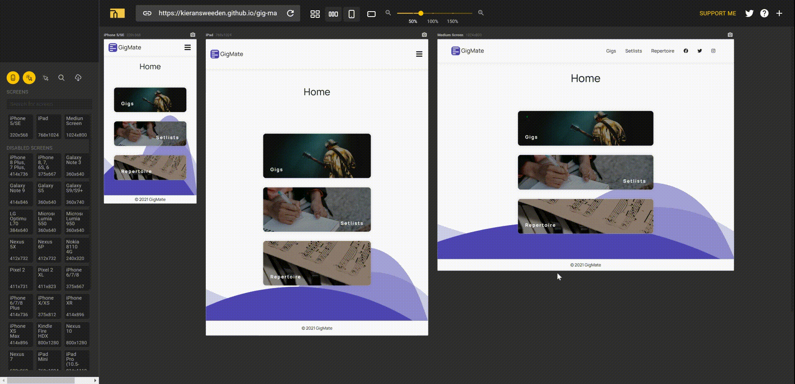
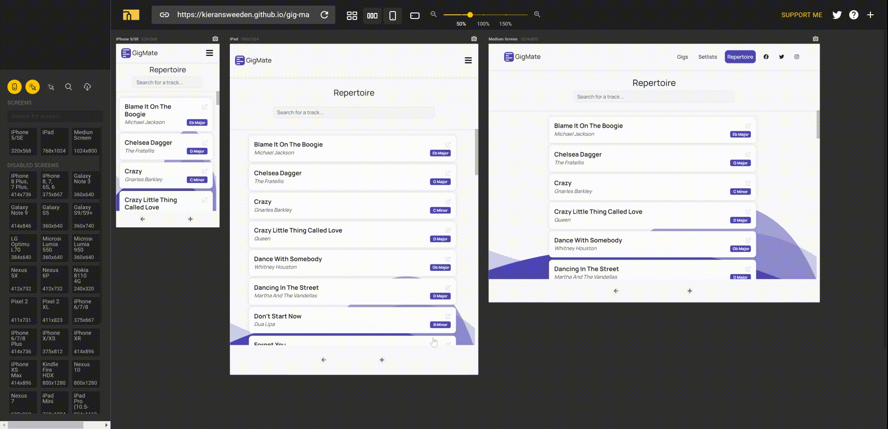
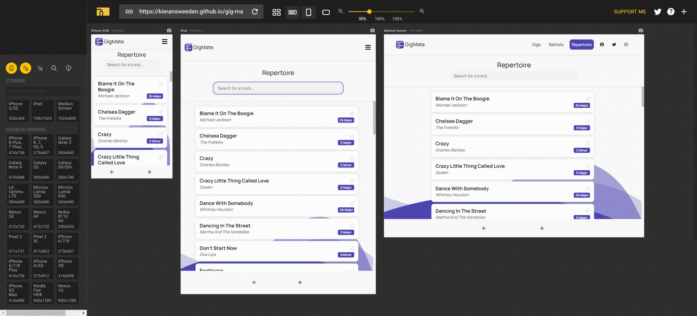
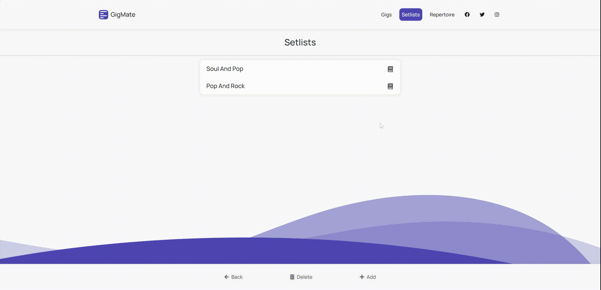
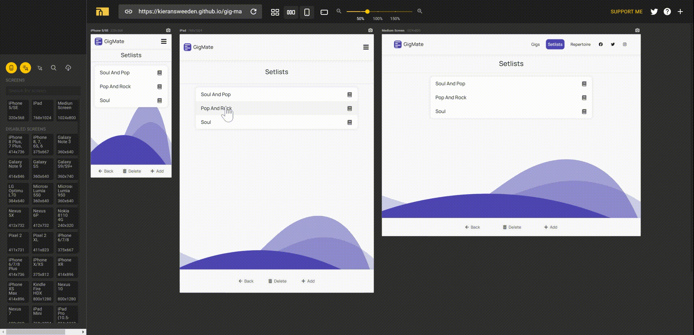
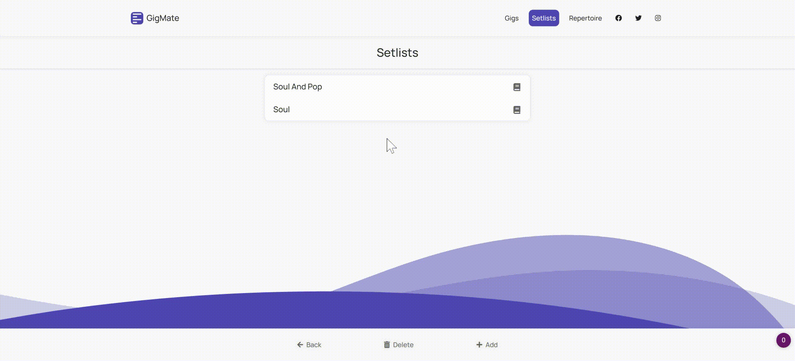
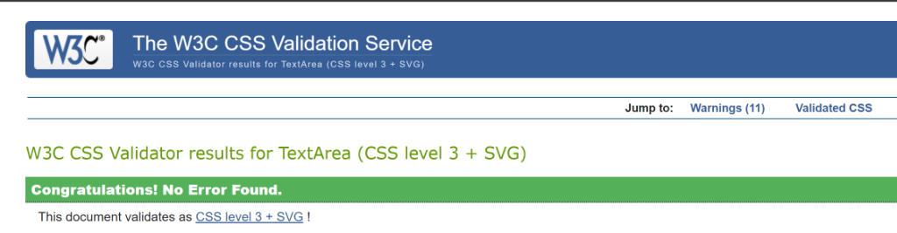
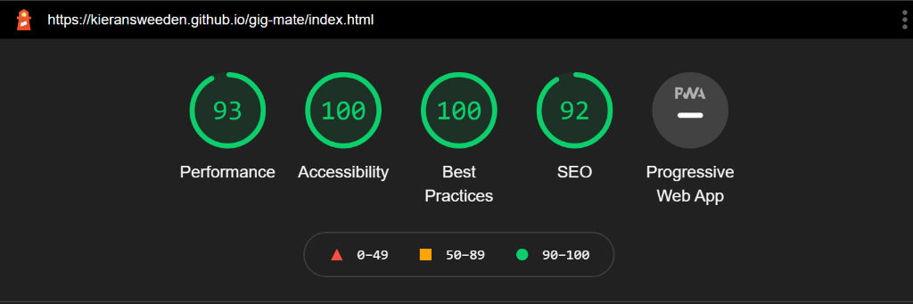
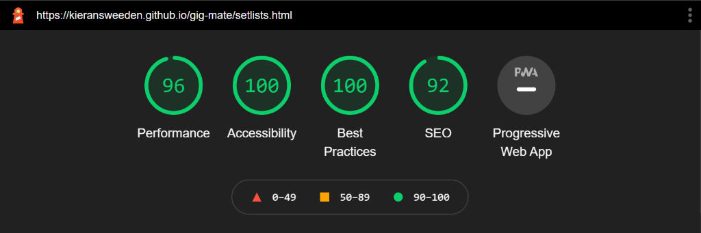
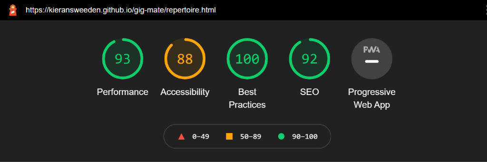

# GigMate Testing

This markdown file documents the development process of GigMate.

To return to the original README file, [click here](README.md).

![link to view GitHub page deployment]

# Contents

1. [Bugs](#Bugs)
    - [Fixed Bugs](#Fixed-Bugs)
    - [Unfixed Bugs](#Unfixed-Bugs)

2. [User Stories Testing](#User-Stories-Testing)

3. [Manual Testing](#Manual-Testing)

4. [Validation Testing](#Validation-Testing)

5. [Performance Testing](#Performance-Testing)

# Bugs

## Fixed Bugs

<details>

<summary><b>Navbar dropdown appearing behind main content.</b></summary>

<br>

- When clicking on the hamburger icon to open the dropdown navbar menu, the menu would appear behind the main content on the page.

- This was promptly solved by addressing the z-index of the element with the class of "navbar-collapse". Giving this element the z-index value of 1 meant the dropdown would always appear above the content underneath the navbar.

<br>

```
*style.css*

.navbar-collapse {
    z-index: 1;
    background-color: var(--gigmate-white);
}
```

</details>

<hr>

<details>

<summary><b>Navbar moving upwards when uncollapsing the dropdown menu.</b></summary>

<br>

- When clicking on the hamburger icon, the dropdown navigation menu would appear and push the navbar upwards, making the navbar appear broken.

- This was solved by giving the container within the navbar a positional value of fixed with adjustments to centre the navigation, with the parent having a positional value of relative.

- Although this is appropriate for mobile & tablet screen sizes, it negatively affected the desktop navbar design. To counteract this, I applied these changes within a media query for screen sizes below 992px.

<br>

```
*style.css*

@media (max-width: 992px) {
    .navbar-collapse {
    position: absolute;
    top: 100%;
    left: 0;
    right: 0;
    }
}
```
</details>

<hr>

<details>

<summary><b>Container not scrolling when using overflow:scroll.</b></summary>

<br>

- Despite applying the value of scroll to the property of overflow that's attached to a container filled with content, the container was not scrolling.

- After viewing [this Stack Overflow post](https://stackoverflow.com/questions/17295219/overflow-scroll-css-is-not-working-in-the-div) and reading [Ionică Bizău](https://stackoverflow.com/users/1420197/ionic%c4%83-biz%c4%83u)'s answer, I recognised this was because the container I was attempting to add a scroll functionality did not have a declared height. After adding a height property & value, this issue was resolved.

<br>

```
*style.css*

.rep-container section {
height: 72.5vh;
overflow: scroll;
}
```

</details>

<hr>

<details>

<summary><b>Scrollbar moving content within container, resulting in an asymmetrical design.</b></summary>

<br>

- Although the scrollbar functionality worked as intended, it took up space within the container which pushed the content to the left, resulting in an asymmetrical design which wasn't intended.

- After viewing [this Stack Overflow post](https://stackoverflow.com/questions/24671317/scrollbar-above-content?rq=1) and reading [Forex](https://stackoverflow.com/users/1384493/forex)'s answer, I realised that instead of scroll, the value of overflow needed to be overlay, which adds scroll functionality and renders the scrollbar above the content rather than within.

<br>

```
.rep-container section {
height: 72.5vh;
overflow: overlay;
}
```

</details>

<hr>

<details>

<summary><b>Presence of UI in Safari & Chrome mobile browsers shortening the viewport window.</b></summary>

<br>

- As clearly demonstrated in [this article](https://dev.to/maciejtrzcinski/100vh-problem-with-ios-safari-3ge9) by Maciej Trzciński, there's an unfortunate problem in Safari (& Chrome in my experience) on mobile devices, where the browsers calculate the top bar, document window and bottom bar together in their implementation of viewport heights. This created an issue where the window was far larger than expected, which caused elements at the bottom of the window such as the footer, to disappear beneath the browser UI.

- To fix this, I used the example provided in the article linked above. The fix takes a CSS variable and changes the value of it by obtaining the documentElement value and applying that value to the CSS variable. When applying the CSS variable to a height property within the html & body elements, the window height will adjust to the documentElement value, providing the intented result of having all elements fitting within the page.

<br>

```
*style.css*

:root {
    --app-height: 100%;
}
```
```
*main.js*

const appHeight = () => {
const doc = document.documentElement
doc.style.setProperty('--app-height', `${window.innerHeight}px`)
}
window.addEventListener('resize', appHeight);
appHeight();
```

</details>

<hr>

<details>

<summary><b>On initial load with no local storage stored, the webpage would store the local JSON files in local storage, however it would not display the intended elements.</b></summary>

<br>

- The webpage contains a function which on DOM load, accesses whether local storage is present within the browser. If there is no presence of local storage, the function pushes stringified JSON to the user's local storage.

- An issue appeared however, where on initial load the browser would take in the stringified JSON but would not display the contents as intended unless the user refreshes the page. The refreshing of the page solves the issue, but this is obviously not acceptable as a user experience.

- The bug was promptly fixed as I had realised the fillWithLocalStorage function was only working when presence of local storage was found. Applying the function after the addJSONToLocalStorage function promptly fixed the issue.

<br>

```
*repertoire.js*

async function checkLocalStorage() {
    if (!localStorage.getItem('repertoire')){
        addJSONToLocalStorage("repertoire");
    } else {
        fillWithLocalStorage("repertoire");
    }
}

async function addJSONToLocalStorage(data) {
    if (data === "repertoire") {
        let repertoire = await fetchInitialJSON('assets/json/initRepertoire.json');
        localStorage.setItem('repertoire', JSON.stringify(repertoire));
    }
    fillWithLocalStorage(data);
}   
```

</details>

<hr>

<details>

<summary><b>Retrieving local storage data using async/await returns promise instead of the intended data.</b></summary>

<br>

- When the DOM loads, a bunch of functions are called to retrieve data from local storage, this was doing using async/await.

- However when attempting to store returned values from an asynchronous function into a variable (called *contentData* in this case), the variable would store a promise instead of the data.

- After viewing [this Stack Overflow answer](https://stackoverflow.com/a/43422983/15607265) however, I realised that every async function returns a promise object. Adding await before function solved this problem.

<br>

```
*setlists.js"

async function startGigMate(contentType) {
    // Firstly, start local storage functionality to determine what data items GigMate will be working with
    let contentData = await collectLocalStorage(contentType);
}
```

</details>

<hr>

<details>

<summary><b>Setlist accordion buttons were being displayed as "[object HTMLLIElement]" instead of the li element HTML content itself.</b></summary>

<br>

- When the DOM loads in setlists.html, the list of setlists should be displayed as an accordion with buttons for each set within each setlist.

- The bug here was that instead of displaying "Set 1", "Set 2" and such, the buttons were displaying "[object HTMLLIElement]".

- [This Stack Overflow answer](https://stackoverflow.com/a/44953851/15607265) by [Musa](https://stackoverflow.com/users/1353011/musa) was helpful in letting me know where to look to solve this issue.

- I later found out that it was because I was attempting to assign the innerHTML of the containing element with an object, rather than the outerHTML of the object itself.

<br>

```
*setlists.js*

// ...then push the set buttons (contentItems[1]) into the setlist item
    document.getElementById(`collapse${reference}`).firstElementChild.firstElementChild.innerHTML = contentItems[1].outerHTML;
```

</details>

<hr>

<details>

<summary><b>Code to identify if a newly created setlist object is identical to an existing setlist object in local storage was not working as intended.</b></summary>

<br>

- When creating a new setlist, the application should first check whether or not the name of the newly created setlist is indentical to one currently in local storage. The code would work on some occasions, but not all the time, making it unreliable.

- I later found out that the code I wrote was tremendously flawed. Using a forEach for the setlist arrays, I noticed that the itemIsDuplicate variable was being updated on each array loop, meaning the state of the last array determined the boolean value of itemIsDuplicate.

- Simplifying the code, initialising the itemIsDuplicate value to false and only turning to true when a match was found, solved this issue.

<br>

```
*setlists.js*

function checkIfDuplicate(createdItem, originalItems, contentType) {
// Create a variable that stores the boolean that dictates whether the created item is a duplicate
let itemIsDuplicate = false;

// If the content type we're dealing with is...
if (contentType === "setlists"){

    // ... setlists, check each setlist name in each stored array
    originalItems.forEach(storedArray => {

        // If the names match, set itemIsDuplicate to true
        if(storedArray.setlistName === createdItem.setlistName){
            itemIsDuplicate = true;
        }
    })
}

// Return the boolean variable 
return itemIsDuplicate;
}
```

</details>

<hr>

<details>


<summary><b>GitHub Pages was not retrieving data from local storage, therefore no setlists were being displayed to the user.</b></summary>

<br>

- When developing GigMate, the local storage was being retrieved and utilised as intended. However when hosted by GitHub Pages, GigMate was storing & later retrieving undefined key and property values in local storage.

- After toying with relative paths and async & await related fixes, I found out it was a URL path issue after inserting console.logs throughout the intial stage of the application. GigMate checks the URL path name to determine what data it'll be working with, as shown below;

<br>

```
*setlists.js prior to fix*

let currentPage = window.document.location.pathname;

// Initialise an empty variable to contain a content type value
let contentType;

// Assign content type depending on the value within current page variable
if (currentPage === "/setlists.html") {
    contentType = "setlists";
} else if (currentPage === "/repertoire.html") {
    contentType = "repertoire";
} else if (currentPage === "/gigs.html") {
    contentType = "gigs";
}
```

- When locally working on GigMate this worked as intended, however the pathname changes when being hosted on GitHub pages, which prefixes the original pathname with "/gig-mate". When adding this as an option for each file name (as shown below), GitHub Pages worked as intended.

<br>

```
*setlists.js after fix*

if (currentPage === "/setlists.html" || currentPage === "/gig-mate/setlists.html") {
    contentType = "setlists";
} else if (currentPage === "/repertoire.html" || currentPage === "/gig-mate/repertoire.html") {
    contentType = "repertoire";
} else if (currentPage === "/gigs.html" || currentPage === "/gig-mate/gigs.html") {
    contentType = "gigs";
}
```

</details>

<hr>

<details>

<summary><b>When attempting to scroll through a set on mobile & tablet, a track card would be dragged instead of the container being scrolled.</b></summary>

<br>

- Instead of scrolling through a set, a track card would be picked up and dragged, resulting in a poor user experience.

- The cause of this issue was that the parent containing the track card's width was 100% of the content container. Setting the width of the parent element to min-content fixed this issue, as it's width would be at it's most minimum whilst still displaying all child elements (the track card).

<br>

```
*style.css*

#list-container li {
width: min-content;
}
```

</details>

<hr>

<details>

<summary><b>Live mode modal being cluttered with numerous tracks from previous sets.</b></summary>

<br>

- When launching live mode, if live mode has been launched previously in the same session, the previous set would persist within the body of the modal. This led to the current set being placed underneath the previous set, resulting in a cluttered live mode experience.

- This was fixed by clearing the ordered list item each time the button was pressed.

<br>

```
*setlists.js*

function fillLiveModalWithTracks(){
// Get the setlist name, set number, modal title & list container
let setlistName = document.getElementById("page-header").textContent;
let setNumber = document.getElementById("page-subheader").textContent;
let liveModalTitle = document.getElementById("live-mode-title");
let liveModalListItemContainer = document.getElementById("live-mode-list");

// Set title text to setlist name & set number
liveModalTitle.textContent = setlistName + " - " + setNumber;

// Make sure the list is clear before inserting tracks
liveModalListItemContainer.innerHTML = "";

// Get the tracks by sending the setlist name & set number
let setTracks = getTracks(setlistName, setNumber);

// For each track...
setTracks.forEach(setTrack => {
    // ... create a live mode track
    let liveModeTrack = createLiveModeTrack(setTrack);

    // ... and insert it into the list container
    liveModalListItemContainer.innerHTML += liveModeTrack;
    })
}  
```

</details>

<hr>

<details>

<summary><b>When checking a set ready for deletion, the set would open instead of being checked.</b></summary>

<br>

- Clicking a set checkbox would open the set and display it's tracks rather than check it's checkbox ready to be deleted. This was due to the button attached to the set button element, which contained an event listener.

- My first attempt of fixing this bug was removing the event listener from the button, however this proved to be impossible given that parameters were being sent to the callback function within the event listener function. This made the function an anonymous function and not a reference, meaning the remove event listener would not work given it requires the exact same reference as the add event listener function. I found this out after looking at [this Medium article](https://medium.com/@DavideRama/removeeventlistener-and-anonymous-functions-ab9dbabd3e7b) by [Davide Rama](https://medium.com/@DavideRama).

- The fix to this issue was to add another parameter to the displaySetlists function, that being the insertingCheckbox. If the parameter is left undefined, it will default to adding the button event listener. If it's anything other than undefined however (such as true), it will avoid adding the event listeners.

<br>

```
*setlists.js*

function displaySetlists(setlists, insertingCheckbox){
    // Display the setlists...

    // ...Get content container
    let contentContainer = document.getElementById("content-container");

    // Get accordion body
    let accordionBody = contentTemplates("setlistAccordionBody");

    // insert accordion body to content container
    contentContainer.innerHTML = accordionBody;

    // Insert accordion items
    setlists.forEach(setlist => {
        // ... retrieve the accordion template containing content respective to this setlist
        let [setlistTemplate, setButtons] = contentTemplates("setlistAccordionItem", setlist);

        // ... display the setlist with the template, set buttons & reference
        displayItems("setlist", [setlistTemplate, setButtons], removeSpaces(setlist.setlistName));
        
        // If intention is to delete setlists, avoid adding event listeners to buttons
        if (insertingCheckbox === undefined){
            // ... add event listeners to the respective set buttons
            insertButtonEventListeners();
        }
    })
}


```

</details>

<hr>

<details>

<summary><b>A console error declaring that a variable containing null could not be operated on with a for each loop.</b></summary>

<br>

- When attempting to save a set in it's current order and state, it would refuse to do so and present a console error stating that a for each loop could not be operated on a variable of null.

- To save the set in it's current order, it requires use of the user's repertoire found from local storage. This is where the issue originated from. Using the user's repertoire in local storage requires the user to open repertoire.html first. So if the user doesn't visit the repertoire.html page and immediately attempts to edit tracks in sets within setlists.html, it would crash as there is no repertoire stored within local storage.

- To fix this, a function taken from repertoire.js that inserts the initial repertoire json file was inserted within setlists.js. This meant that no matter what, the user had a repertoire present in local storage and the editing functionality would work as intended.

```
*setlists.js*

async function checkPresenceOfRepertoire(){
    // If repertoire does not exist in local storage...
    if(!localStorage.getItem('repertoire')){
        // push the initial repertoire file to local storage
        pushToLocalStorage("repertoire", await getInitialJSONData("assets/json/init-repertoire.json"));
    }
}

```

</details>

<hr>

## Unfixed Bugs

Here are a list of current bugs that are currently known within GigMate and will be squashed when possible.

<details>

<summary><b>Duplicate tracks update one another within the repertoire</b></summary>

<br>

- When a track is created with the exact same name as another, alterations made to one will affect the other.

- It's unlikely a user would input the same track twice, however it is absolutely possible. Therefore this bug will be squashed when time is available.

</details>

<hr>

[Return to Contents 🡡](#contents)

# User Stories Testing

User story testing was performed manually, serving the purpose of documenting how a user will navigate the site and checking that interactive elements are working as intended.

As a professional musician using GigMate, I want the ability to:
1. View my repertoire of tracks.



<hr>

2. Add a new track to my repertoire of tracks.



<hr>

3. Filter through my repertoire of tracks.



<hr>

4. Edit a track within my repertoire.


<hr>

5. Delete a track from my repertoire.


<hr>

6. View my list of setlists.


<hr>

7. Create a new setlist and set the amount of sets it has.

    - Could not display/record multiple screen instances at once, as each instance would add a new setlist and the last two instances would display an alert message as the setlist already exists (from the first instance).



<hr>

8. Delete a setlist completely or the sets within it.



<hr>

9. Edit a track within a set, that's independent from the respective track within the repertoire.


<hr>

10. Alter the order of the tracks within a set using Drag & Drop.



<hr>

11. Add a single track or multiple tracks to a set.


<hr>

12. Delete a single track or multiple tracks from a set.


<hr>

13. View the set full screen so I can use GigMate for live use.


<hr>

14. Use GigMate on multiple devices and the functionality is consistent on all devices.


<hr>

15. Have dark mode functionality when using the application for live use.


<hr>

[Return to Contents 🡡](#contents)

# Manual Testing

[Return to Contents 🡡](#contents)

# Validation Testing

- Index.html validation results

- Setlists.html validation results

- Repertoire.html validation results

- Style.css validation results

    

- Setlists.js validation results

- Repertoire.js validation results

[Return to Contents 🡡](#contents)

# Performance Testing

- Index.html lighthouse performance score:

    

- Setlists.html lighthouse performance score:

    

- Repertoire.html lighthouse performance score:

    


[Return to Contents 🡡](#contents)